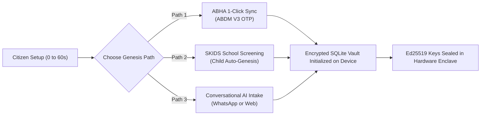
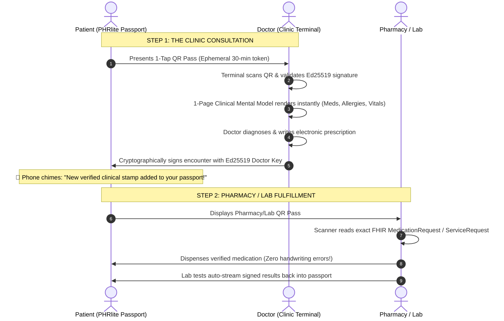

# PHRlite: The Sovereign Health Passport
## Human-Centric Architecture, UPI-Style Encounters & Jailbreak-Proof Integrity

---

## 1. Why "Health Passport" is the Winning Mental Model

For decades, digital health failed because it was called an **"Electronic Medical Record (EMR)"** or a **"Personal Health Record (PHR)"**. 
- To a patient, an "EMR" sounds like hospital administrative paperwork they don't own.
- To a doctor, a "PHR" sounds like an unverified scrapbook of patient self-diagnoses and unorganized notes.

A **Passport** changes everything:

| Passport Metaphor | Traditional Healthcare | PHRlite Health Passport |
| :--- | :--- | :--- |
| **Ownership** | Hospital or portal owns the silo | **Citizen holds the physical passport in their pocket** |
| **Stamps** | Buried in inaccessible EHR servers | **Verified clinical stamps signed by authorized authorities** |
| **Checkpoints** | Endless paperwork & redundant history | **Frictionless presentation at clinic, pharmacy, or lab** |
| **Portability** | Locked to single hospital chain | **Universal validity across cities, clinics, and countries** |
| **Sovereignty** | Server scans your entire history | **Zero-knowledge presentation: inspect validity without data exfiltration** |

---

## 2. The Human Story: Before vs. After


### The "Before": The Plastic Bag of Despair
* **The Clipboard Inquisition:** Every hospital visit starts with 20 minutes of holding an ink pen with a broken cap, trying to recall: *"What antibiotic gave my 6-year-old hives in 2023? What was my mother's blood pressure dosage? Was it 25mg or 50mg?"*
* **The Faded Thermal Receipt:** Prescriptions printed on cheap thermal paper that fade into illegible grey smudges after 4 months in a drawer.
* **The Diagnostic Tax:** Because Clinic B cannot see the blood test done yesterday at Clinic A, the patient pays \$80 to get their arm pricked twice in 24 hours.
* **The Fatal Interaction:** The doctor, rushed in a 5-minute OPD consult, writes an NSAID prescription unaware the patient has a severe chronic ulcer or sulfa allergy.

### The "After": The Sovereign Health Passport
* **Instant Peace of Mind:** You walk into any clinic in the country. You don't bring a single paper folder.
* **1-Tap QR Presentation:** The doctor scans your pass. In 30 seconds, their screen renders your **1-Page Clinical Mental Model**—active conditions, current medications, severe allergies highlighted in bold red, and baseline wearable vitals.
* **Continuous Pediatric Lineage:** Your child's growth curves, vision screenings, and dental checks from their school health camp (SKIDS) are already stamped, verified, and permanent.
* **Zero Repeated Tests:** Past blood counts, HbA1c curves, and ECGs are instantly legible in standard HL7 FHIR format.

---

## 3. How Easy It Is to Make the Passport (Under 60 Seconds)

Creating a Health Passport requires zero clinical jargon:



1. **Path 1: The ABHA 1-Click Sync (ABDM V3)**
   - Enter your 14-digit ABHA number (`XX-XXXX-XXXX-XXXX`) or mobile number.
   - Receive a single OTP from National Health Authority (NHA).
   - Your citizen profile and past hospital visits linked to your ABHA address (`name@abdm`) are pulled into your local SQLite vault.
2. **Path 2: The School Health Genesis (SKIDS)**
   - When a child receives an annual health screening at school through SKIDS, a child passport is automatically initialized.
   - Parents receive a secure SMS/WhatsApp claim link. With one biometric tap, the child's vision, hearing, dental, and cardiac baseline stamps are transferred to the parent's family vault.
3. **Path 3: Conversational AI & Prescription Snap**
   - No ABHA? Simply chat with the onboarding bot for 2 minutes.
   - Snap a smartphone camera photo of your current medicine strip or prescription. The vision model translates it into an NRCES-compliant FHIR MedicationStatement and signs it locally.

---

## 4. Clinical Encounters as Easy as UPI

India transformed money with **UPI** (Unified Payments Interface)—replacing cash, change, and bank queues with a 3-second QR scan. **PHRlite does the exact same thing for healthcare.**


### The 3-Step "Health UPI" Transaction:



### 1. At the Clinic Desk (The Check-In)
- **Like Scanning a Merchant QR:** The patient opens PHRlite and taps **"Clinic Pass"**.
- The doctor scans the dynamic QR code using a standard webcam or 2D barcode scanner.
- **Instant Consent:** Grants an ephemeral 30-minute read token. 
- **The Doctor's Screen:** In under 1 second, the doctor's screen displays the **1-Page Clinical Mental Model**:
  - 🚨 **Red Alert Banner:** Allergies (e.g. *Sulfa Drugs ➜ Facial Swelling*).
  - 💊 **Active Medications:** *Salbutamol 100mcg, Metformin 500mg*.
  - 📋 **Active Problems:** *Mild Persistent Asthma, Type-2 Diabetes*.
  - ⌚ **Wearables:** *Resting HR 64 bpm, SpO2 99%, BP 118/76*.
- **The Sign & Stamp:** When the consult ends, the doctor clicks **"Sign & Stamp"**. Their digital key stamps an immutable commit onto the patient's record. **The patient's phone chimes immediately.**

### 2. At the Pharmacy
- Patient walks down the street to any pharmacy and shows the **"Medication QR"**.
- The pharmacist scans it. The exact generic molecule, dosage form, and schedule load into their POS billing system.
- **Zero handwriting misinterpretations.** No guessing if "Cipralex" was "Cephalex".

### 3. At the Diagnostic Lab
- The lab technician scans the **"Lab Order Pass"**.
- Standardized LOINC/SNOMED investigation codes (e.g. *HbA1c, Complete Blood Count, Lipid Profile*) feed directly into lab analyzers.
- Once blood work is analyzed, the pathologist's digital signature stamps the structured FHIR `Observation` bundle directly into the patient's passport—no lost paper slips.

---

## 5. Security Architecture: Jailbreak-Proof, Modern & Interoperable

How do we ensure that a user cannot tamper with their own records (e.g., faking a vaccination or prescription), and how do we protect sensitive health data even if the phone is rooted or jailbroken?

```
┌────────────────────────────────────────────────────────────────────────┐
│                   SOVEREIGN HARDWARE SECURITY STACK                    │
├────────────────────────────────────────────────────────────────────────┤
│ 1. HARDWARE SILICON ENCLAVE (Apple Secure Enclave / Android StrongBox) │
│    • Private keys (Ed25519) generated inside hardware chip.            │
│    • Keys CANNOT be extracted, even with kernel root / jailbreak.       │
│    • All signatures require local biometric auth (Face ID / Touch ID). │
├────────────────────────────────────────────────────────────────────────┤
│ 2. MERKLE HASH CHAIN INTEGRITY (Git for Healthcare)                    │
│    • Every commit stores: H(seq + timestamp + author + payload + parent)│
│    • Local DB tampering breaks the SHA-256 hash chain instantly.       │
├────────────────────────────────────────────────────────────────────────┤
│ 3. INDELIBLE PROVIDER STAMPS (Zero-Trust Clinical Verification)        │
│    • A user cannot fabricate a prescription or vaccine record.          │
│    • Each stamp is cryptographically signed by the Doctor / Hospital.  │
│    • Any pharmacy or school verifies against the National Registry.    │
├────────────────────────────────────────────────────────────────────────┤
│ 4. ZERO-KNOWLEDGE CLOUD STORAGE (AES-256-GCM)                          │
│    • Encrypted client-side before touching Cloudflare R2 / relay.      │
│    • Cloudflare sees only opaque ciphertext blobs. Zero server access. │
└────────────────────────────────────────────────────────────────────────┘
```

### Jailbreak-Proof Defense Mechanisms:
1. **Hardware-Enclaved Identity:**
   - On iOS, keys reside in the **Secure Enclave**; on Android, in **StrongBox / Android Keystore**.
   - Even if malware gains root access (`su`) or the phone is jailbroken, the hardware processor refuses to dump raw private keys.
2. **Provider Key Authority (Why Faking Fails):**
   - Suppose a compromised device tries to modify a prescription from *Paracetamol* to a controlled narcotic.
   - The clinic's or pharmacy's software validates the signature `Ed25519_Verify(Doctor_PubKey, Payload, Signature)`.
   - Because the user does not possess the doctor's private key, the signature verification fails instantly.
3. **Zero-Knowledge Cloudflare Vault:**
   - All backups pushed to Cloudflare R2 are encrypted using **AES-256-GCM** with keys derived from the user's master secret via PBKDF2/Argon2.
   - Cloudflare acts as an unthinking relay. Even under government subpoena or server breach, zero bytes of health data can be decrypted without the patient's biometric device.

---

## 6. ABDM Stack (Ayushman Bharat Digital Mission) Integration

The Indian Government's **Ayushman Bharat Digital Mission (ABDM)** has laid down the digital public infrastructure for India. PHRlite aligns natively with ABDM open-source architecture:

### ABDM V3 Architectural Mapping:
* **ABHA (Ayushman Bharat Health Account):**
  - Standardized 14-digit citizen health identifier and human-readable ABHA address (`firstname.lastname@abdm`).
  - PHRlite vaults can be linked to an ABHA address with 1-tap OTP.
* **HIP (Health Information Provider) Role:**
  - When SKIDS conducts school screenings or a partner clinic consults, PHRlite acts as an authorized HIP, publishing FHIR milestone bundles.
* **HIU (Health Information User) Role:**
  - Clinicians using the PHRlite doctor copilot act as an HIU, pulling consent-approved historic records.
* **ABDM Consent Manager (ISO/TS 17975 Compliance):**
  - Granular, purpose-based consent artifacts: specifying exactly which categories of records (e.g. *Diagnostic Reports only, excluding Mental Health*), for what duration (e.g. *1 hour*), and for which specific doctor.
* **NRCeS FHIR R4 Standard Profiles:**
  - National Resource Centre for EHR Standards (NRCeS) profiles are followed across all records:
    1. `PrescriptionRecord`
    2. `OPConsultRecord`
    3. `DiagnosticReportRecord`
    4. `DischargeSummaryRecord`
    5. `ImmunizationRecord`

---

## 7. Open-Sourced Indian Drug & Terminology Libraries

To make clinical encounters seamless without doctor typos or proprietary lock-in, PHRlite incorporates India's official open-source pharmaceutical databases:

1. **NLEM (National List of Essential Medicines):**
   - Published by the Ministry of Health and Family Welfare (MoHFW).
   - Standardizes 384+ essential generic therapeutic molecules, approved dosage forms, and strengths.
2. **PMBJP (Jan Aushadhi) Open Drug Master:**
   - Over 1,965 generic medications and 293 surgical consumables with standardized generic drug codes.
   - Enables instant price transparency: when a doctor prescribes a molecule, the patient's passport can show the Jan Aushadhi generic alternative at an 80% lower cost.
3. **National Formulary of India (NFI):**
   - Published by the Indian Pharmacopoeia Commission (IPC).
   - Provides standardized clinical guidance, contraindications, and drug-drug interaction warnings (such as the Sulfa-allergy warning in the PHRlite Copilot).
4. **NRCeS SNOMED CT India Drug Extension:**
   - Standard clinical drug concepts mapping chemical substances to branded formulations, enabling instant, error-free translation between hospital EMRs and retail pharmacies.
